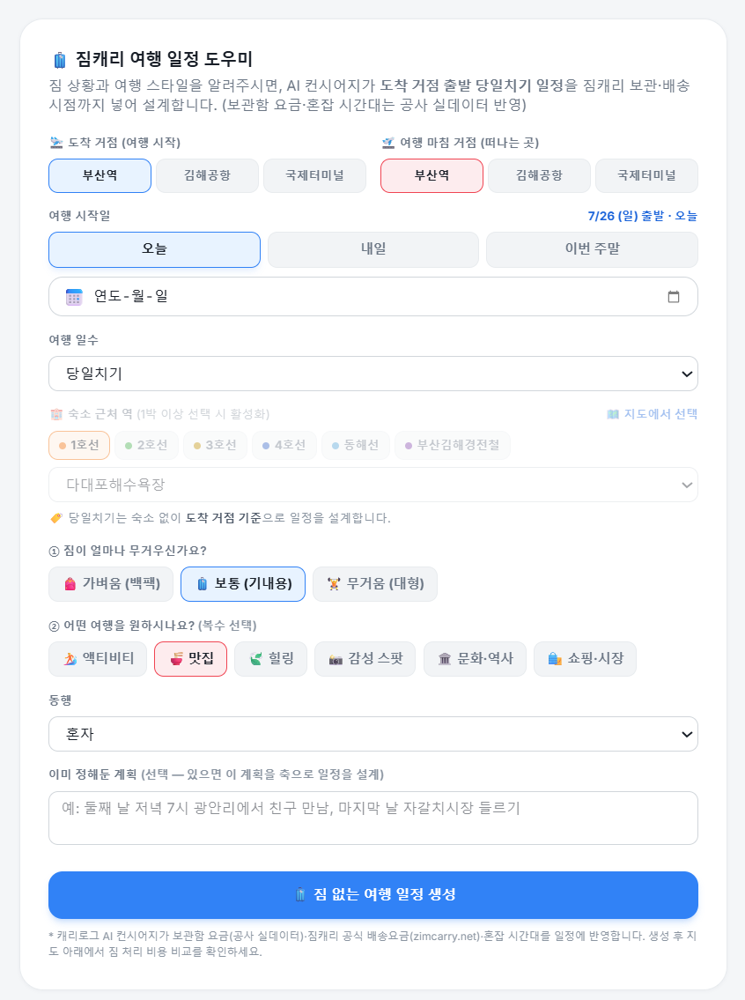
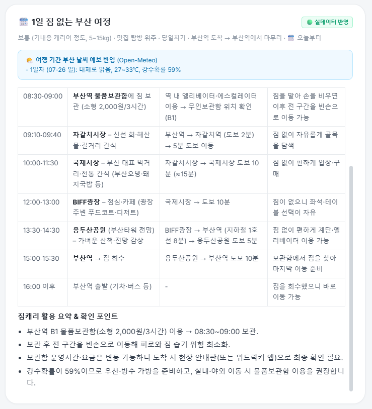
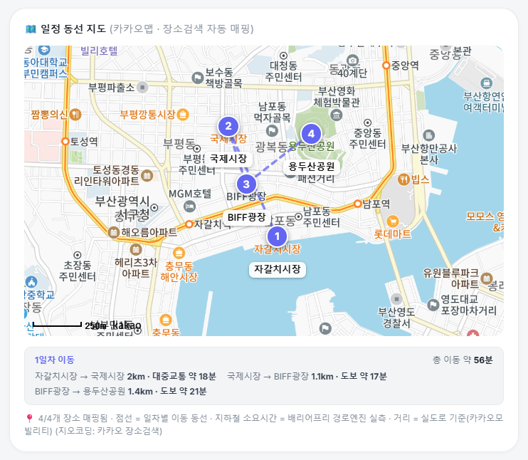
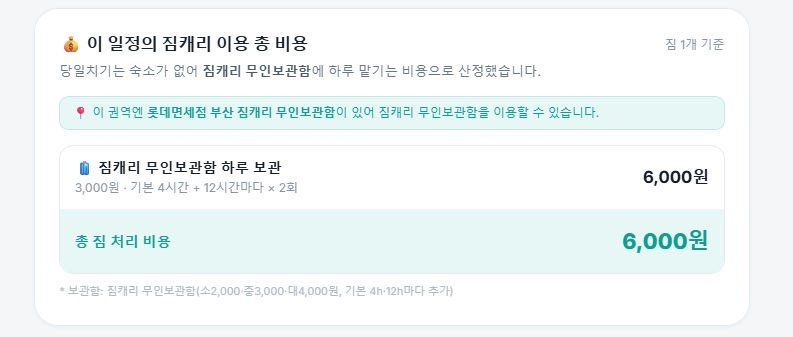
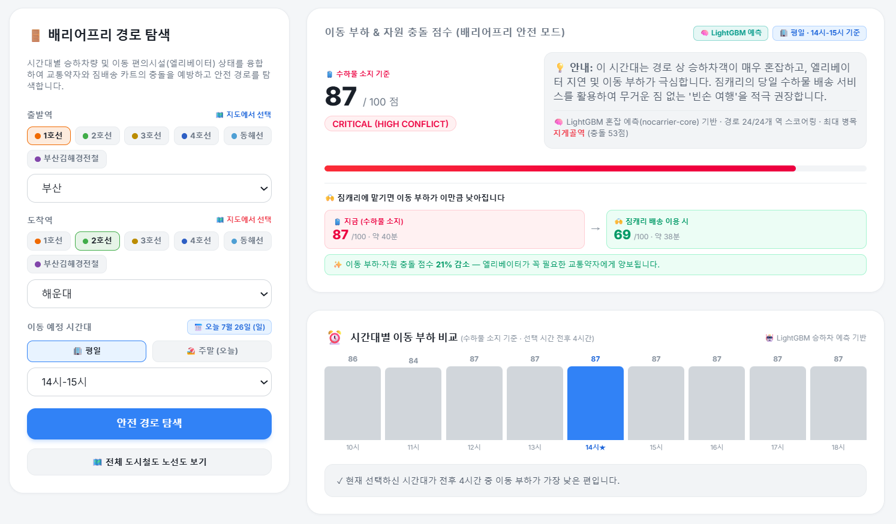
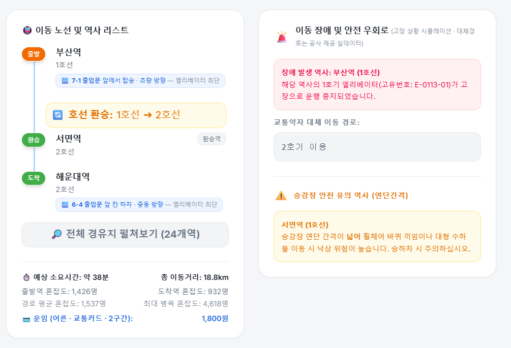
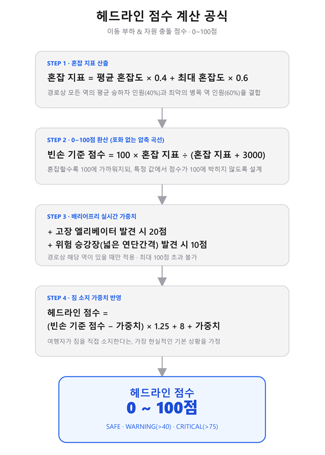
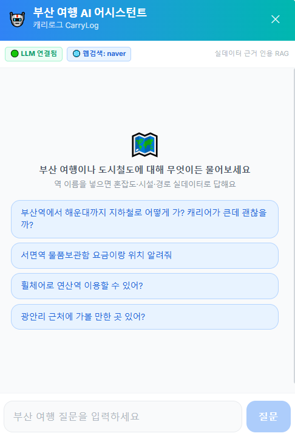
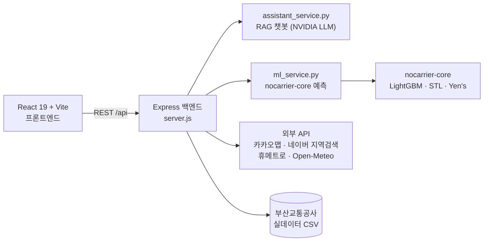

<div align="center">


# 캐리로그 CarryLog

**짐 없는 부산 여행의 시작** — 부산교통공사 × 짐캐리 데이터 융합 · DIVE 2026 해커톤

[](code/frontend-react)
[](code/frontend-react)
[](code/frontend-react)
[](code/backend)
[](code/nocarrier-core)
[](code/nocarrier-core)

여행객의 짐을 짐캐리 보관·배송으로 덜어내고, 교통약자에게 안전한 배리어프리 경로를 제공하는<br/>
**AI 기반 부산 도시철도 여행 플랫폼**

</div>

---

## ✨ 주요 기능

### 🧳 AI 여행 일정 도우미

짐 상황(무게·개수)과 여행 스타일을 입력하면 AI 컨시어지가 **짐캐리 보관·배송 시점까지 포함된 당일치기~다박 일정**을 설계함. 물품보관함 요금·혼잡 시간대는 부산교통공사 실데이터 반영.

| 일정 입력 | AI 생성 일정 |
|:---:|:---:|
|  |  |

생성된 일정은 **카카오맵 기반 동선 지도**로 시각화되고(장소 자동 지오코딩·구간별 실도로 이동시간), 짐캐리 이용 시 총 짐 처리 비용까지 산정해 줌.

| 일정 동선 지도 | 짐 처리 비용 산정 |
|:---:|:---:|
|  |  |

### 🚶 배리어프리 라우팅 (교통약자 안전 경로)

시간대별 승하차량 예측과 엘리베이터 상태를 융합해 **교통약자와 짐배송 카트의 충돌을 예방하는 안전 경로**를 탐색함. LightGBM 혼잡 예측(nocarrier-core) 기반으로 경로 상 모든 역을 스코어링하고, 짐캐리에 짐을 맡겼을 때 이동 부하가 얼마나 낮아지는지 비교해 보여줌.



엘리베이터 고장 시 **대체 이동 경로 실데이터**로 우회를 안내하고, 승강장 연단간격이 넓어 휠체어·대형 수하물에 위험한 역은 별도로 경고함.



<details>
<summary><b>📐 이동 부하 & 자원 충돌 점수 산식 (0~100점)</b></summary>
<br/>

혼잡 지표(평균 40% + 최대 병목 60%) → 0~100 압축 → 고장 엘리베이터·위험 연단간격 실시간 가중치 → 짐 소지 가중치 순으로 계산함.



</details>

### 🤖 부산 여행 AI 어시스턴트 (RAG 챗봇)

역 이름을 넣으면 혼잡도·시설·경로 실데이터를 근거로 인용하며 답하는 **RAG 기반 챗봇**. NVIDIA LLM + 임베딩 재랭킹, 네이버 웹검색 근거를 결합했음.

<div align="center"></div>

### 📊 종합 분석 대시보드

역별 혼잡도 추이와 주요거점·권역별 짐배송 이동 흐름을 Chart.js로 시각화함.

---

## 🧠 AI 모델 (nocarrier-core)

| 컴포넌트 | 기법 | 성능 |
|---|---|---|
| 혼잡도 예측 | **LightGBM** 회귀 (시간대·요일·lag/rolling 피처) | 홀드아웃 MAE **31.65명** |
| 이벤트 스파이크 감지 | **STL 분해** (통계적 시계열 분석) | 학습 데이터 불필요 |
| 자원 충돌 점수 | 투명한 가중 산식 (설명가능성 우선) | — |
| 경로 탐색 | 그래프 탐색 (**Yen's algorithm**, 대안 경로 k개) | — |
| 우회 난이도 분류 | **LightGBM** 분류 (실제 엘리베이터 고장 932건 학습) | 정확도 **89.3%** |
| 승강장 안전 | 연단간격 실데이터 룩업 | — |

자세한 설계 배경은 [nocarrier-core README](code/nocarrier-core/README.md) 참고.

## 🏗️ 시스템 구성



## 📁 폴더 구조

```
├─ code/
│  ├─ backend/          # Express API 서버 + Python 서비스 (RAG 챗봇, ML 예측)
│  ├─ frontend-react/   # React 19 + Vite + Tailwind 프론트엔드
│  ├─ nocarrier-core/   # 혼잡도 예측·배리어프리 라우팅 ML 코어 (Python)
│  └─ sdbwork/          # 실험·프로토타입 작업 공간
├─ docs/                # 기획 제안서, 발표자료, 회의록, 노선도, 스크린샷
├─ icon/                # 앱 아이콘
├─ _archive/            # 과거 스크립트·컴포넌트 보관
└─ 참가자_제공_데이터/   # (git 미포함) 해커톤 제공 원본 데이터
```

## 🚀 실행 방법

**1. 환경변수** — `code/backend/.env.example`을 `code/backend/.env`로 복사하고 API 키를 채워 넣을 것. (휴메트로·네이버·NVIDIA·카카오 — 발급처는 예시 파일 주석 참고)

**2. 데이터** — `참가자_제공_데이터/`와 `code/nocarrier-core/data/`는 저장소에 미포함. 팀 내부 채널로 공유받아 같은 경로에 배치해야 함.

```bash
# 백엔드 (http://localhost:3000)
cd code/backend
npm install
node server.js
```

```bash
# 프론트엔드 (http://localhost:5173)
cd code/frontend-react
npm install
npm run dev
```

## 👥 팀

> **Team ACCSLAB** · 지도교수: 손준영 교수님

| 이름 | 이메일 | 담당 |
|------|--------|------|
| **성도범** | sdb0605@naver.com | Project Manager, LLM+RAG 개발 |
| **권태현** | tgwon0947@gmail.com | 프론트엔드 개발 및 기획 |
| **정중환** | wwat1313@gmail.com | 서버, 백엔드 개발 |
| **카트로브 아딜렛** | adilet.kadyrov@outlook.com | LightGBM 모델 개발 |
